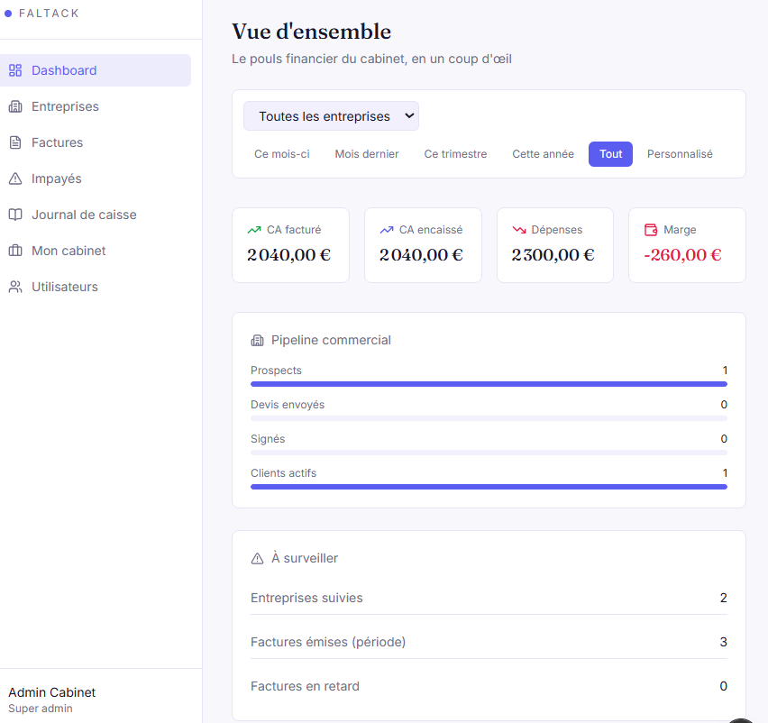
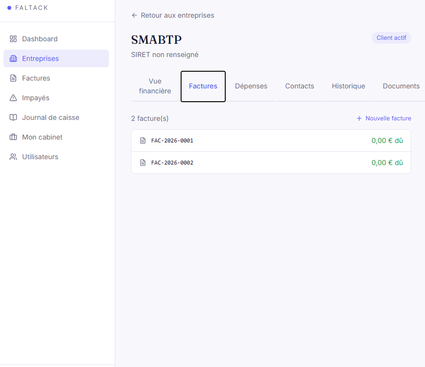
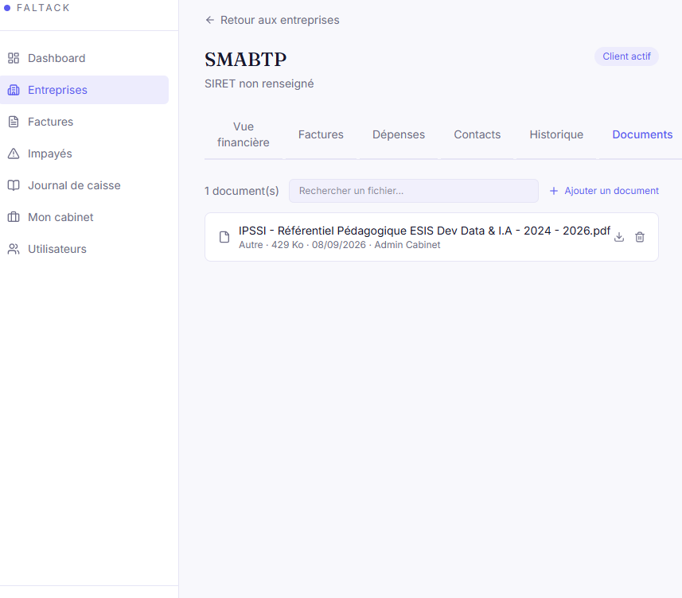
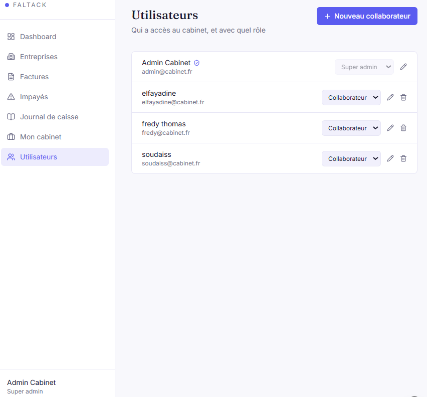
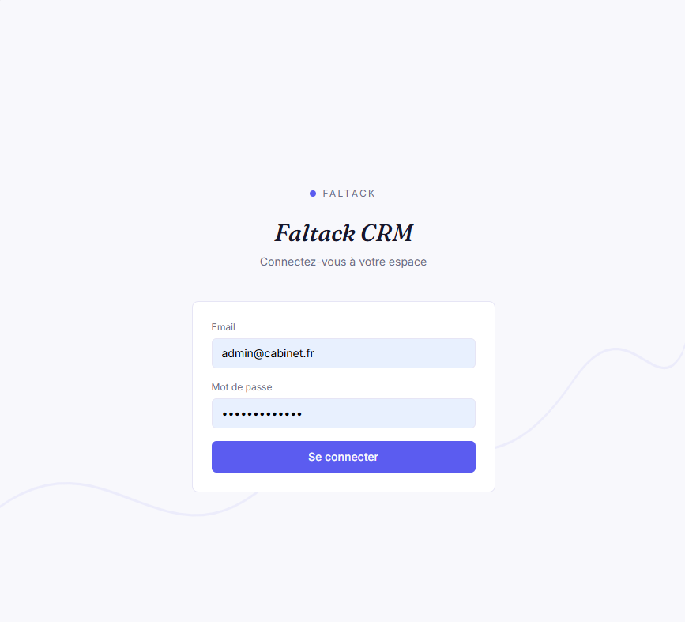

# Faltack CRM


CRM et gestion financière pensés pour un cabinet comptable : suivi des entreprises clientes, facturation, paiements, impayés, dépenses, documents et pilotage de l'activité du cabinet.

---

## Vue d'ensemble

Le dashboard réunit le pouls financier du cabinet : CA facturé et encaissé, dépenses, marge, pipeline commercial et points de vigilance. Les données sont filtrables par entreprise et par période.



## Fonctionnalités

### CRM

- Pipeline commercial : Prospect → Devis envoyé → Signé → Client actif
- Fiches entreprises et contacts
- Historique des échanges : notes, appels, emails, tâches

### Facturation et paiements

- Devis et factures, numérotation automatique, TVA, export PDF
- Paiements complets ou partiels, journal de caisse
- Tableau des impayés avec calcul des jours de retard
- Relance pré-rédigée pour chaque facture en attente, prête à envoyer



### Analyse financière par entreprise

- CA facturé, CA encaissé, dépenses et marge
- Taux de marge, taux d'impayés, délai moyen de paiement, évolution du CA
- Diagnostic automatique : points forts, points faibles, opportunités
- Évolution sur 6 mois et répartition des dépenses par catégorie

### Pilotage du cabinet

- Prestations facturées et encaissées par le cabinet, pour ses clients suivis comme occasionnels
- Dépenses internes (salaires, loyer, fournitures) et marge du cabinet
- Classement des clients les plus rentables
- Historique des paiements filtrable par type de client, montant, mois ou période

### Gestion documentaire

Chaque entreprise dispose de son espace documentaire : contrats, justificatifs, courriers. Les fichiers sont stockés sur Supabase Storage avec un historique des versions et une recherche par nom.



### Utilisateurs et permissions

Trois rôles, avec des droits distincts appliqués côté serveur comme côté interface.

| Action | Super admin | Collaborateur | Client |
|---|:---:|:---:|:---:|
| CRM, facturation, suivi des entreprises | ✅ | ✅ | Lecture seule |
| Saisir une prestation | ✅ | ✅ | ❌ |
| Marquer une prestation payée | ✅ | ❌ | ❌ |
| Saisir une dépense interne du cabinet | ✅ | ❌ | ❌ |
| Gérer les comptes utilisateurs | ✅ | ❌ | ❌ |

Le rôle Client est cloisonné à sa propre entreprise : il ne voit jamais les données des autres.



### Authentification

Connexion par email et mot de passe, mots de passe hachés avec bcrypt, sessions gérées par token JWT.



---

## Stack technique

| Couche | Technologies |
|---|---|
| Frontend | Next.js (App Router), React, Tailwind CSS, Recharts |
| Backend | Node.js, Express, Sequelize |
| Base de données | PostgreSQL (Supabase) |
| Stockage fichiers | Supabase Storage |
| Divers | PDFKit (factures), Multer (upload), bcrypt, JWT |

## Architecture

```
backend/
  src/
    config/        connexion base de données et Supabase Storage
    models/        modèles Sequelize et associations
    controllers/   logique métier
    routes/        points d'entrée de l'API
    middleware/    authentification et permissions par rôle
    utils/         calculs de facturation
frontend/
  src/
    app/(app)/     pages de l'application
    lib/           client API, authentification, formatage
```

## Installation

### Prérequis

- Node.js 20 ou plus
- Un projet Supabase : base PostgreSQL et bucket de stockage privé nommé `documents`

### Backend

```bash
cd backend
npm install
cp .env.example .env   # puis renseigner les variables
npm run dev            # http://localhost:4000
```

Variables d'environnement :

```
PORT=4000
DB_HOST=
DB_NAME=
DB_USER=
DB_PASSWORD=
JWT_SECRET=
SUPABASE_URL=
SUPABASE_SERVICE_ROLE_KEY=
```

### Frontend

```bash
cd frontend
npm install
npm run dev            # http://localhost:3000
```

Variable optionnelle : `NEXT_PUBLIC_API_URL`, par défaut `http://localhost:4000/api`.

## Feuille de route

- [ ] Envoi automatique des relances par email
- [ ] Rapprochement bancaire
- [ ] Exports Excel et CSV
- [ ] Factures récurrentes
- [ ] Notifications et rappels d'échéance

## Auteur

Soudaiss Elfayadine — [LinkedIn](https://www.linkedin.com/in/VOTRE-PROFIL)
